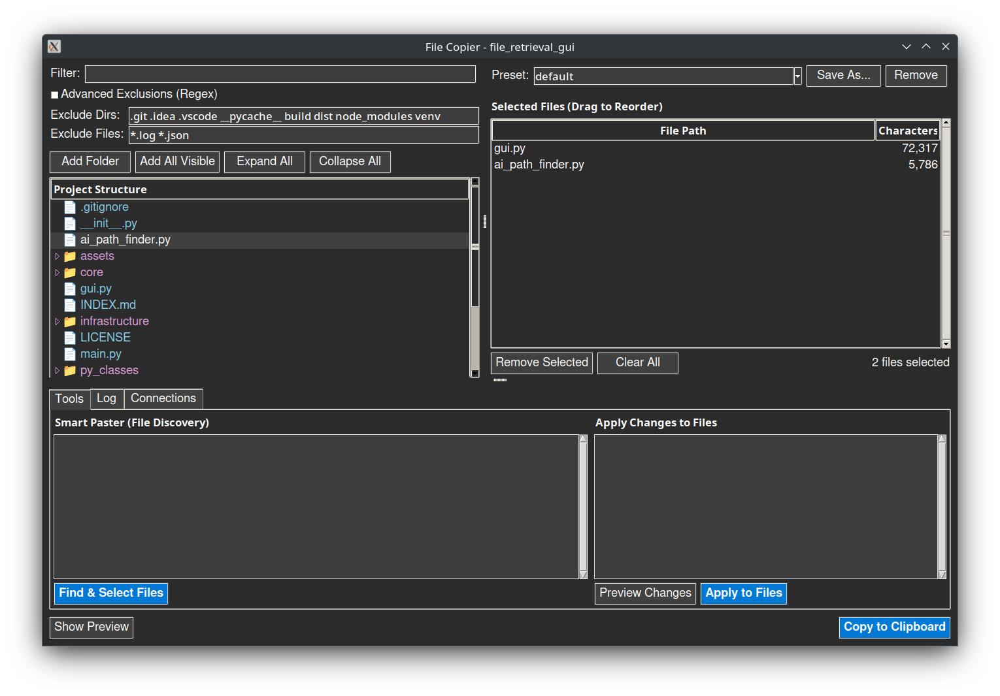

# File Retrieval GUI

A powerful file management tool for flexible and scalable filesystem interactions.



## Features

- 📋 **Multi-Selection Interface** - Drag & drop reordering with clipboard integration
- 🔍 **Preview Changes** - GitHub-style diff viewer before applying modifications
- 🔌 **WebSocket Server** - Real-time broadcasting to connect external tools
- 🎯 **Smart Filtering** - Regex-based exclusions and search
- 📁 **Smart File Discovery** - Intelligent file path extraction from text content

## Quick Start

```bash
# Install dependencies
pip install -r requirements.txt

# Run GUI
python main.py .

# Run CLI mode (reads from clipboard)
python main.py -m .
```

## Usage
Launch the interface to browse, select, and manage files:
```bash
python main.py
```
- Use **Smart Paster** to select files based on paths extracted from text
- Use **Apply Changes** to modify files with preview-before-apply functionality
- WebSocket server runs on port 8765 for external tool integration (see `tools/getuserfiles.py`)

## License

